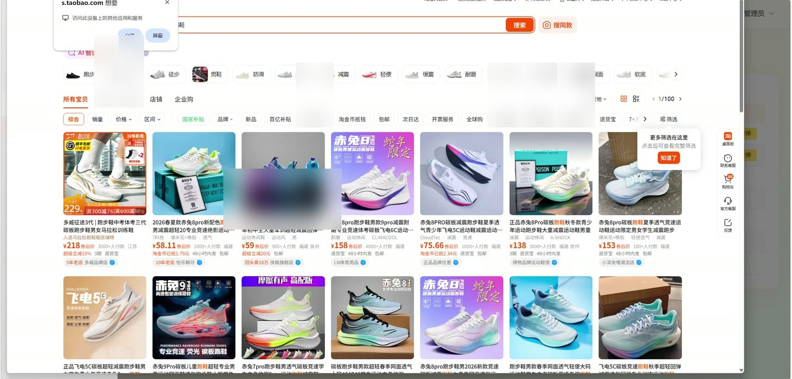
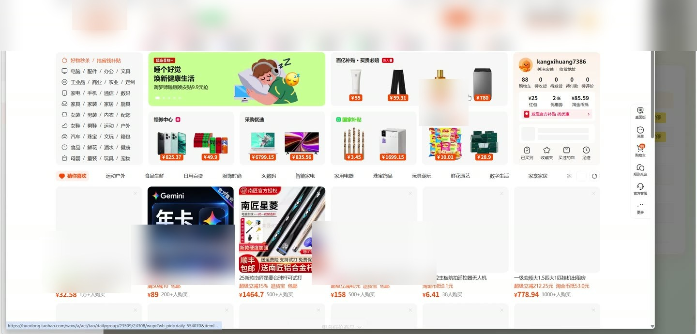
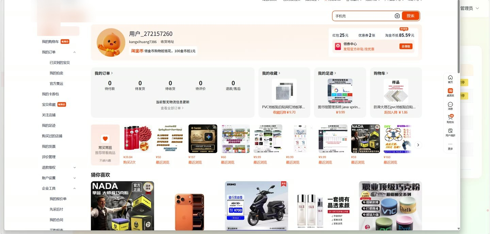
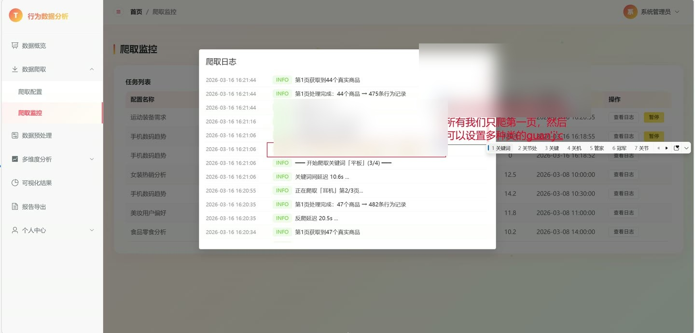

# (附文档)Python+机器学习+Vue3 淘宝用户行为数据分析系统

**技术栈**：Python、Flask、机器学习、Vue3、MySQL

### 系统简介

本系统是一套基于 Python 与机器学习算法构建的淘宝用户行为数据分析平台，采用前后端分离架构，后端提供 REST 接口，前端以单页应用形式呈现。系统围绕用户行为数据的采集、清洗、分析与可视化展开，包含数据爬取、数据预处理、多维分析与报告导出等完整链路，登录后由管理员统一操作。
 
### 核心功能
 
### 管理员端

 
- 账号登录：输入用户名与密码完成身份校验，登录成功后写入令牌并跳转数据概览页，路由守卫拦截未登录访问。 
- 数据概览：展示总行为量、独立用户数、商品数、购买次数四项指标卡片，并渲染行为类型分布饼图、24 小时活跃趋势折线图、类目行为量 TOP10 柱状图。 
- 最近分析记录：在概览页侧栏按时间倒序展示最近 5 条分析记录，含分析类型标签、名称与创建时间。 
- 淘宝账号登录：检测淘宝账号登录状态，点击登录后拉起浏览器扫码，前端每 3 秒轮询登录结果，成功后缓存 Cookie 并更新状态指示灯。 
- 退出淘宝登录：确认后清除已缓存的淘宝登录凭证，状态回退为未登录。 
- 爬取配置管理：新建、编辑、删除爬取配置，支持设置配置名称、关键词、爬取页数、时间范围、行为类型与爬取频率。 
- 爬取配置列表：分页展示配置的名称、关键词、页数、频率、状态与创建时间，按状态显示草稿、已启用、每日调度中、每周调度中等标签。 
- 启动与停止爬取：对非运行中配置点击启动爬取，对运行中配置执行停止操作，单次频率配置支持重新执行。 
- 爬取监控：分页查看爬取任务列表，展示配置名称、状态、进度条、已获取记录数、速度与开始时间。 
- 任务日志查看：按任务 ID 拉取日志列表，按级别以不同颜色展示时间、级别标签与日志内容。 
- 任务暂停：对运行中的爬取任务执行暂停操作并刷新任务列表。 
- 数据预处理：一键执行数据去重、缺失值填充、异常值过滤三类操作，返回影响记录数并写入预处理日志。 
- 数据预览：展示总数据量、缺失类目数与样本数据表，字段含用户 ID、商品 ID、商品标题、价格、店铺、类目、行为类型、行为时间与来源。 
- 预处理日志：分页查看操作类型、详情、影响记录数与执行时间。 
- 行为频次分析：按时间范围筛选后统计总行为量、浏览占比、加购占比、购买占比，并输出行为类型占比饼图、小时级活跃趋势、每日行为趋势与星期分布图。 
- 类目分析：按时间范围统计各类目的浏览、收藏、加购、购买量与转化率，输出类目行为量排名堆叠柱状图、类目转化率排名图与类目详细数据表。 
- 用户价值分析：对用户进行价值分层与排名分析。 
- 关联规则分析：设置最小支持度与最小置信度后执行挖掘，输出前项、后项、支持度、置信度、提升度规则列表与关联强度可视化柱状图。 
- 可视化结果：集中查看已保存的分析图表结果。 
- 报告导出：填写报告名称，选择全维度或单维度报告、勾选行为频次/类目/用户价值/关联规则维度、选择 Excel 或 Word 格式后生成报告。 
- 历史报告管理：分页展示报告名称、类型、格式、大小与生成时间，支持下载与删除。 
- 个人中心：修改昵称、邮箱、手机号并保存，上传更换头像，修改登录密码。 
- 爬取模板管理：新建与删除爬取模板，设置名称、关键词、页数、行为类型与频率。 
- 图表管理：查看已保存图表的名称、类型与创建时间，支持删除。 
- 分析历史：按行为频次、类目、用户价值、关联规则筛选历史分析记录，展示类型、名称、结果摘要、状态与时间。
 
### 技术栈

 后端语言Python 后端框架Flask 数据分析与挖掘机器学习算法、关联规则挖掘 数据库MySQL 前端框架Vue3 前端路由Vue Router 状态管理Pinia UI 组件库Element Plus 图表库ECharts（vue-echarts） 构建工具Vite
 
### 交付内容

 
- 后端完整源码 
- 前端完整源码 
- 数据库初始化脚本 
- 万字文档

## 界面展示

---

## 获取完整源码 + 万字文档

本仓库为项目介绍页。**完整前后端源码、数据库初始化脚本、万字项目文档**，请加微信 `kangkangcode`，或访问 [codekk.top](http://codekk.top) 获取。

可作课程设计 / 毕业设计参考，支持远程部署调试。